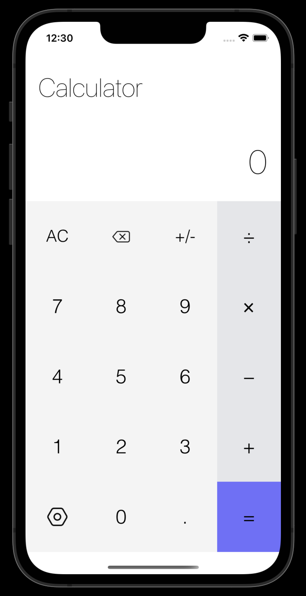

# Calculator-app-UIKit-swift

PET project: calculator app UIKit swift


---

### Screenshots
<table>
  <tr>
    <td></td>
    <td></td>
</table>

### About it:
- This is my first project on Swift.
- It is usual calculator with default operations. 
- In the project, I tried to keep track of all edge cases.

### Installation

1. Clone the repo via git clone command.
```
https://github.com/MustafaNatur/Calculator-app-UIKit-swift.git
```
2. Open in Xcode
```
open Wheelstreet.xcworkspace
```
